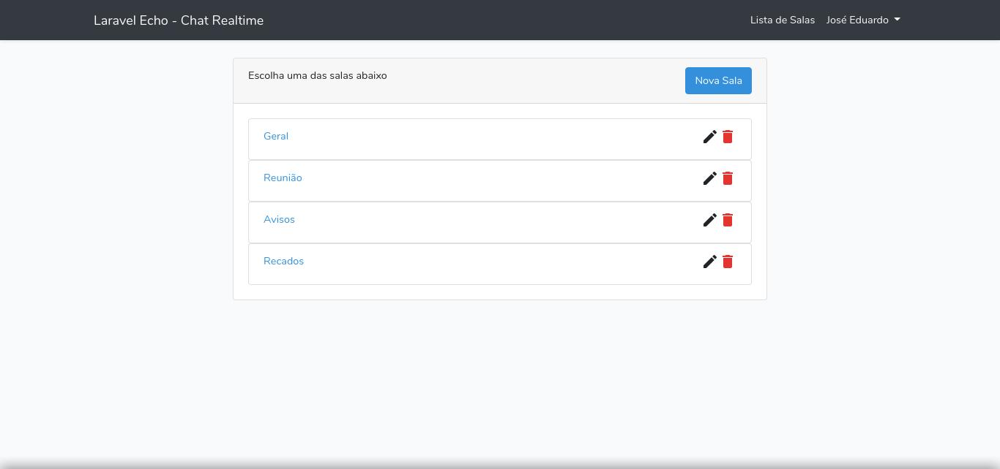
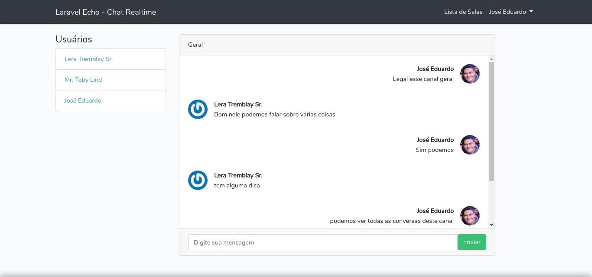

# Simple chat using Laravel Echo and Pusher


preview list rooms  


preview chat  
    


## About

This project creates a chat system, in the room list screen it is possible to create, edit and delete rooms. After creating a room it is possible to enter
 in the room and start a chat with users who are online and in that room.
The system notifies you when a user enters the room.
In the room you can view the conversation history, as well as chat.

**The images of users are the site [GRAVATAR](https://pt.gravatar.com/emails)**

### Start this application
First install package  
composer
```bash
composer install
```

NPM
```bash
npm install
```
create a database sql and set your configuration in .env file

A [Pusher](https://pusher.com/, "create account in this link") account is required. Create account and set this information according to the parameters required of the file .env  

.env 
```json
DB_CONNECTION=mysql
DB_HOST=127.0.0.1
DB_PORT=3306
DB_DATABASE='your database name'
DB_USERNAME='your user database'
DB_PASSWORD='your password database'

BROADCAST_DRIVER=pusher

PUSHER_APP_ID='your id'
PUSHER_APP_KEY='your key'
PUSHER_APP_SECRET='your secret'
PUSHER_APP_CLUSTER='your cluster'
```

Run database 
```bash
php artisan migrate --seed
```

start php server
```bash
php artisan serve
```

start node server mode watch
```bash
npm run development -- --watch
```

## Set configs Laravel for Echo

resources/js/bootstrap.js
```bash
window.Echo = new Echo({
    broadcaster: 'pusher',
    key: 'yor key',
    cluster: 'mt1',
    forceTLS: true,
    encrypted: false
});
```

## License

The project is open-source software licensed under the [MIT license](https://opensource.org/licenses/MIT).
